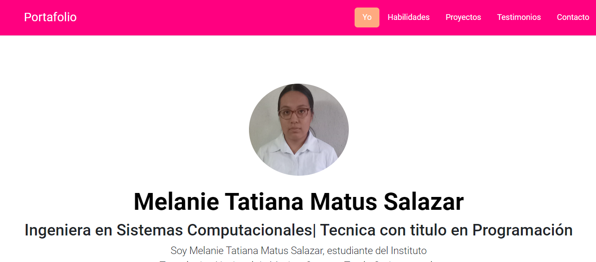

# Portafolio de Melanie  Tatiana Matus Salazar
## Proyecto responsivo realizado con Bootstrap 5

Proyecto creado durante el bootcamp de Tecolochicas Pro, es adaptable a distintos dispositivos o tamañaos d pantalla.
El proposito de está página web es mostrar mi Portafolio de Proyectos como desarrolladora web.😊

Podrás encontrarlo aquí [Portafolio](https://github.com/MelTati?tab=repositories).

## Tecnolochicas

* HTML
* CSS
* Bootstrap 5
* JAVASCRIPT

## El proyecto cuenta con las siguientes secciones:

* Sobre mi
* Habilidades
* Proyectos
* Contacto

## Captura del proyecto

